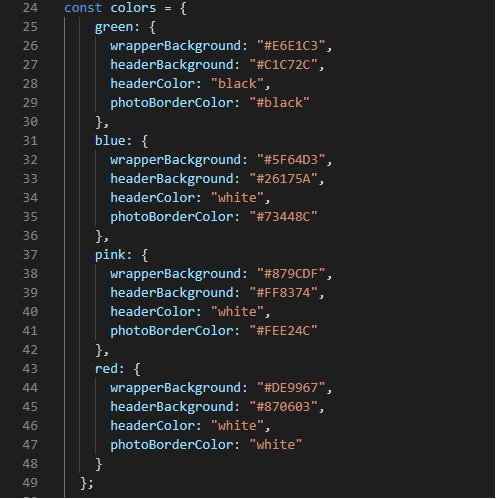
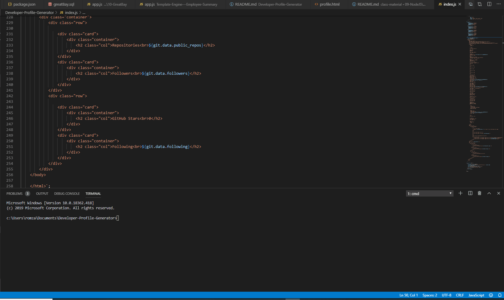
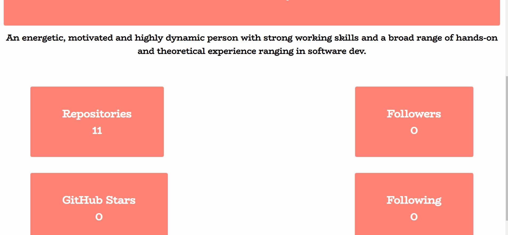

# Unit 09 Node.js and ES6+ Homework: Developer Profile Generator

## The user will be prompted for a favorite color, which will be used as the background color for cards.

## Input process :

The PDF will be populated with the following:
* Profile image
* User name
* Links to the following:
  * User location via Google Maps
  * User GitHub profile
  * User blog
* User bio
* Number of public repositories
* Number of followers
* Number of GitHub stars
* Number of users following

